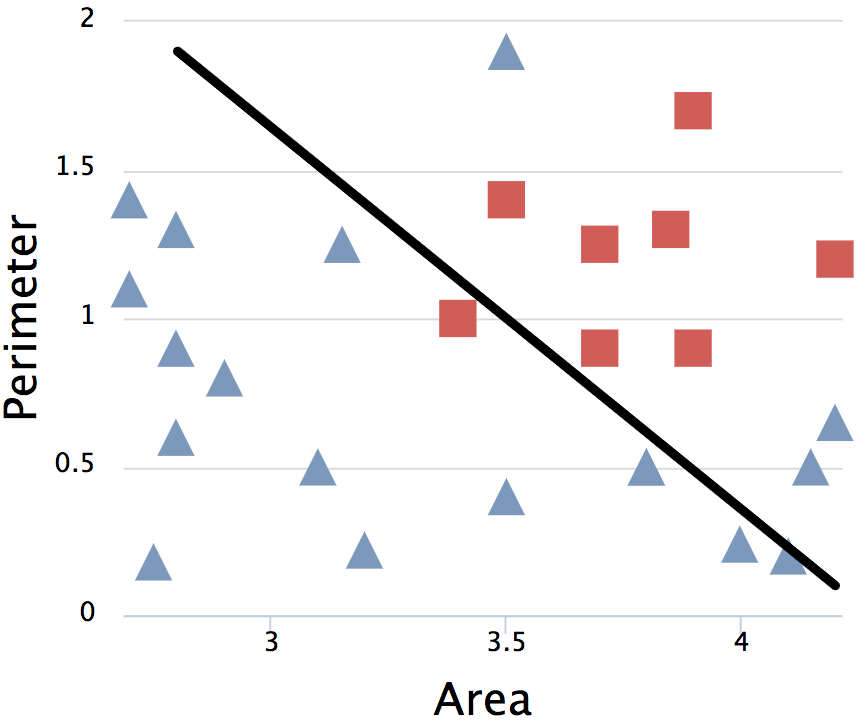
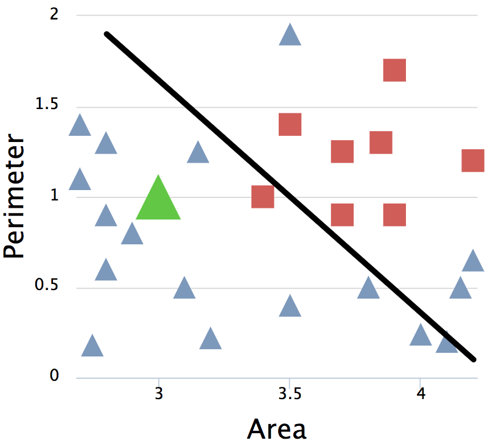
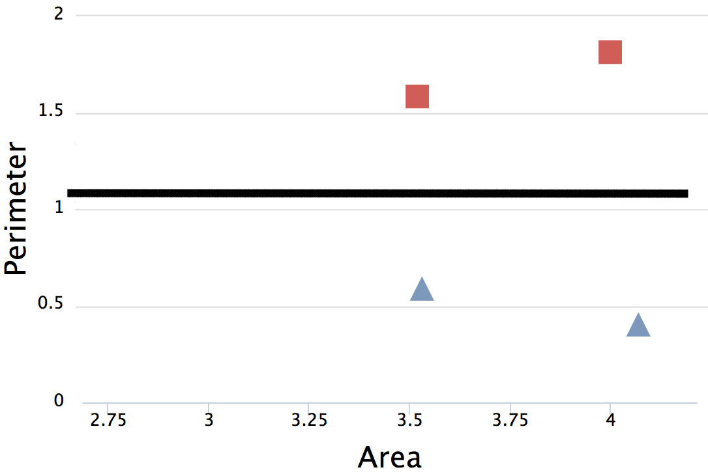

<!-- .slide: data-background="images/network-background.jpg" class="background" -->

<h2>Best Practices of AI in Business</h2>
<h4>The Institute for Ethical AI & ML</h4>
<p>
  <br />
  <br />
    Alejandro Saucedo <br/><br/>
    <a href="http://twitter.com/AxSaucedo">@AxSaucedo</a><br/>
    <a href="http://linkedin.com/in/AxSaucedo">in/axsaucedo</a><br/>
  <br />
</p>
<p>

[NEXT]
<!-- .slide: data-background="images/network-background.jpg" class="background" -->


<h2>Best Practices of AI in Business</h2>
<h4>The Institute for Ethical AI & ML</h4>

<table class="bio-table">
  <tr>
    <td style="float: left">
        
        <br>
        <font style="font-weight: bold; color: white">Alejandro Saucedo</font>
        <br>
        <br>
    </td>
    <td style="float: left; color: white; font-size: 0.7em;">

        <br>
        Chairman
        <br>
        <a style="color: cyan" href="http://ethical.institute">The Institute for Ethical AI & ML</a>
        <br>
        <br>
        AI Fellow / Member
        <br>
        <a style="color: cyan" href="#">The RSA & EU AI Alliance</a>
        <br>
        <br>
        Advisor
        <br>
        <a style="color: cyan" href="http://teensinai.com">TeensInAI.com initiative</a>
        <br>
        <br>
        Chief Engineer
        <br>
        <a style="color: cyan" href="http://eigentech.com">Exponential Technologies</a>
        <br>
        <br>
        
    </td>
  </tr>
  <tr>
  </tr>
</table>

[NEXT]
<!-- .slide: data-background="images/network-background.jpg" class="background smallquote" -->

## Best practices of AI in business

> Overview of The Institute
> <br>
> <br>
> Core concepts
>
> Best practices in industry
> 
> Next steps


[NEXT]
<!-- .slide: data-background="images/network-background.jpg" class="background smallquote" -->

#### The Institute for Ethical AI & ML
<iframe style="height: 50vh; width: 100vw" src="http://ethical.institute"></iframe>
#### <a href="http://ethical.institute">http://ethical.institute</a>

[NEXT]
<!-- .slide: data-background="images/network-background.jpg" class="background smallquote" -->

## Our phased rollout plan
* **Phase 1 - Ethical ML by pledge**
    * Commit as a technology leader<br><br>
* **Phase 2 - Ethical ML by process**
    * Implement the internal processes to your workplace<br><br>
* **Phase 3 - Ethical ML by certification**
    * Obtain the certifications required<br><br>
* **Phase 4 - Ethical ML by regulation**
    * Implement policy based on case-studies


[NEXT]
<!-- .slide: data-background="images/network-background.jpg" class="background smallquote" -->

## Moral-consciousness matrix

| | | |
| - | - | - |
| | Conscious | Unconscious | 
| Moral | ✅ | ❌ |
| Immoral | ❌ | ❌ |
| | | |


<br>

### People can be <font color="#00ffda">conscious</font> and <font color="#00ffda">moral</font>


[NEXT]
<!-- .slide: data-background="images/particles.gif" class="background smallquote" -->

# #LetsDoThis


[NEXT SECTION]
<!-- .slide: data-background="images/parti.png" class="background smallquote" style="color: white" -->

# 1. Core concepts

[NEXT]
<!-- .slide: data-background="images/parti.png" class="background smallquote" style="color: white" -->

## A. Karpathy Software 2.0 (ML)

1) We specify some goal on the behavior of a desirable program (instead of coding it)
```
(e.g., “satisfy a dataset of input-output pairs of examples,” 
or, “win a game of Go”)
```
2) write a rough skeleton of the code
```
(e.g., a neural net architecture) that identifies a 
subset of program space to search, 
```
3) use the computational resources at our disposal to search this space for a program that works.

[NEXT]
<!-- .slide: data-background="images/parti.png" class="background smallquote" style="color: white" -->

## In essence, all Machine Learning is:

If I was to give you a set of examples

Would you be able to learn the answers?


<br>
#### Let's have a look at an example


[NEXT]
<!-- .slide: data-background="images/parti.png" class="background smallquote" style="color: white" -->
Given some input data, predict the correct output


Let's try to build a system to predict whether a shape is a square or a triangle

## How do we do this?


[NEXT]
<!-- .slide: data-background="images/parti.png" class="background smallquote" style="color: white" -->
## First, let's visualise it

* Imagine a 2-d plot
* The x-axis is the area of the input shape
* The y-axis is the perimeter of the input shape


[NEXT]
<!-- .slide: data-transition="slide-in fade-out" data-background="images/parti.png" class="background smallquote" style="color: white" -->
## Which function divides the data

<br>

<div class="left-col">
The line defined by function
<br>
<br>
**$f(x̄) = mx̄ + b$**, where:
<br>
<br>
**x̄** is input (area & perimeter) </li>
<br>
<br>
**m** and **b** are weights/bias
<br>
</div>



[NEXT]
<!-- .slide: data-transition="fade-in slide-out" data-background="images/parti.png" class="background smallquote" style="color: white" -->
## Then we can predict new data

<br>

<div class="left-col">
The result **$f(x̄)$** states whether it's a triangle or square
<br>
<br>
(e.g. if it's larger than 0.5 it's triangle otherwise square)
</div>




<br>
<br>

[NEXT]
<!-- .slide: data-background="images/parti.png" class="background smallquote" style="color: white" -->

So now let's start with a blank brain

[  ]

The machine knows nothing yet...

[NEXT]
<!-- .slide: data-background="images/parti.png" class="background smallquote" style="color: white" -->
Now let's take some data examples


And let the machine do the learning


[NEXT]
<!-- .slide: data-transition="slide-in fade-out" data-background="images/parti.png" class="background smallquote" style="color: white" -->
## The machine does the learning


We give it two examples (one square, one triangle)

[NEXT]
<!-- .slide: data-transition="fade-in" data-background="images/parti.png" class="background smallquote" style="color: white" -->
## The machine does the learning



We give it more examples

[NEXT]
<!-- .slide:data-transition="fade-in slide-out" data-background="images/parti.png" class="background smallquote" style="color: white" -->
## The machine does the learning


and more...


[NEXT]
<!-- .slide: data-background="images/parti.png" class="background smallquote" style="color: white" -->
## Minimising loss function

We optimise the model by **minimising its loss**.

Keep adjusting the weights...

...until loss is not getting any smaller.


[NEXT]
<!-- .slide: data-transition="slide-in fade-out" data-background="images/parti.png" class="background smallquote" style="color: white" -->
## Finding the weights!


When it finishes, we find optimised weights and biases

i.e. **$f(x̄)$ = triangle  if ($0.3 x̄ + 10$) > 0.5 else square**

[NEXT]
<!-- .slide: data-transition="fade-in slide-out" data-background="images/parti.png" class="background smallquote" style="color: white" -->
## Now predict new data


We now have a system that "knows" how to differentiate triangles from squares


[NEXT]
<!-- .slide: data-background="images/parti.png" class="background smallquote" style="color: white" -->

### As your technical functions grow...


[NEXT]
<!-- .slide: data-background="images/parti.png" class="background smallquote" style="color: white" -->

### So should your infrastructure


[NEXT]
<!-- .slide: data-background="images/parti.png" class="background smallquote" style="color: white" -->

# Growing jobs

## Data Scientists 
In charge of development of models

## Data Engineers 
In charge of development of data pipelines

## DataOps / ML Engineers
In charge of productionisation of models, data pipelines & products


[NEXT]
<!-- .slide: data-background="images/parti.png" class="background smallquote" style="color: white" -->

## The core principles:
* Explainability
* Reproducibility
* Monitoring 
* Compliance

[NEXT]
<!-- .slide: data-background="images/parti.png" class="background smallquote" style="color: white" -->
## Let's see how we can implement these


[NEXT SECTION]
<!-- .slide: data-background="images/partistat.png" class="background smallquote" style="color: white" -->

# 2. Best Practices in Industry

[NEXT]
<!-- .slide: data-background="images/partistat.png" class="background smallquote" style="color: white" -->

# Ethics by Pledge
## The Machine Learning Pledge
#### The 8 commitments to ensure ethics by design


[NEXT]
<!-- .slide: data-background="images/partistat.png" class="background smallquote" style="color: white" -->

## 1. Ensure augmented (as opposed to artificial)


<div class="left-col">

<h3>Bad</h3>
Automate end-to-end process from start

<br>
<br>

<h3>Better</h3>
Understand process, add human-in-the-loop, evaluate

</div>
<div class="right-col">


</div>

_note_
### Bad
Have the system automatically going through all records taking the first-hand predictions without signoff on lower confidence fields

### Better
Ensure there is a process for a human signoff based on predictions and have a process for low confidence fields


[NEXT]
<!-- .slide: data-background="images/partistat.png" class="background smallquote" style="color: white" -->

## 2. Evaluation of bias in development and production

<div class="left-col">

<h3>Bad</h3>
Train on ALL data, deploy, don't check

<br>
<br>

<h3>Better</h3>
Optimise training, focus on edge cases, monitor

</div>
<div class="right-col">


</div>

_note_

### Bad
Train the dataset on all previous cases and assume it works well

### Better
Run in-depth analysis of distribution of data based on traits to ensure the model does not discriminate unfairly

[NEXT]
<!-- .slide: data-background="images/partistat.png" class="background smallquote" style="color: white" -->

## 3. Address job displacement implications

<div class="left-col">

<h3>Bad</h3>
Push for automation unconsciously

<br>
<br>

<h3>Better</h3>
Understand and address automation implications

</div>
<div class="right-col">


</div>

_note_

### Bad
Push for automation without taking into consideration the implications of job automation

### Better
Understand the implication of both automating the process and reducing the costs for the service (which may lead to total increase in demand)


[NEXT]
<!-- .slide: data-background="images/partistat.png" class="background smallquote" style="color: white" -->

## 4. Practical understanding on accuracy


<div class="left-col">

<h3>Bad</h3>
Always try to blindly increase accuracy number

<br>
<br>

<h3>Better</h3>
Find relevant metrics for accuracy & cost function

</div>
<div class="right-col">


</div>

_note_
### Bad
Take percentage accuracy increases as face-value and assume a higher number is better

### Better
Ensure you run consistent cross-validated and bias-reduced sets of tests/simulations to ensure that accuracy increase is objective


[NEXT]
<!-- .slide: data-background="images/partistat.png" class="background smallquote" style="color: white" -->

## 5. Compliance by design

<div class="left-col">

<h3>Bad</h3>
Use complex models without care 

<br>
<br>

<h3>Better</h3>
Add domain knowledge to introduce transparency

</div>
<div class="right-col">


</div>


[NEXT]
<!-- .slide: data-background="images/partistat.png" class="background smallquote" style="color: white" -->

## 6. Reproducibility by design

<div class="left-col">

<h3>Bad</h3>
Assume previous models won't be re-used 

<br>
<br>

<h3>Better</h3>
Have a process to ensure reproducibility and compatibility

</div>
<div class="right-col">


</div>

_note_
none


[NEXT]
<!-- .slide: data-background="images/partistat.png" class="background smallquote" style="color: white" -->

## 7. Trust beyond the user

<div class="left-col">

<h3>Bad</h3>
Assume stakeholders understand data usage

<br>
<br>

<h3>Better</h3>
Build and communicate processes around data/meta-data, privacy, etc

</div>
<div class="right-col">


</div>

_note_
none


[NEXT]
<!-- .slide: data-background="images/partistat.png" class="background smallquote" style="color: white" -->

## 8. Identify and address cybersecurity risks

<div class="left-col">

<h3>Bad</h3>
Assume there isn't a need to protect models 

<br>
<br>

<h3>Better</h3>
Identify and address threats for tricking, circumventing or hacking mathematical models created

</div>
<div class="right-col">


</div>

_note_
none


[NEXT]
<!-- .slide: data-background="images/partistat.png" class="background smallquote" style="color: white" -->

# Next steps

Applying this thinking into your actual projects 

## #LetsDoThis


[NEXT SECTION]
<!-- .slide: data-background="images/spaceline.jpg" class="background smallest" style="color: white" -->
# 3. Final words

[NEXT]
<!-- .slide: data-background="images/spaceline.jpg" class="background smallest" style="color: white" -->

## Today we covered

> AI/ML Recap
> <br>
> <br>
> Opportunities & Risks
>
> Ethics by design
> 
> Next steps!

[NEXT]
<!-- .slide: data-background="images/spaceline.jpg" class="background smallest" style="color: white" -->
### Code
https://github.com/axsauze/apc-2018-privacy-conference

### Slides
https://axsauze.github.io/apc-2018-privacy-conference


[NEXT]
<!-- .slide: data-background="images/spaceline.jpg" class="background smallest" style="color: white" -->

<h2>Best Practices of AI in Business</h2>
<h4>The Institute for Ethical AI & ML</h4>

<table class="bio-table">
  <tr>
    <td style="float: left">
        
        <br>
        <font style="font-weight: bold; color: white">Alejandro Saucedo</font>
        <br>
        <br>
    </td>
    <td style="float: left; color: white; font-size: 0.7em;">

        <br>
        Chairman
        <br>
        <a style="color: cyan" href="http://ethical.institute">The Institute for Ethical AI & ML</a>
        <br>
        <br>
        AI Fellow / Member
        <br>
        <a style="color: cyan" href="#">The RSA & EU AI Alliance</a>
        <br>
        <br>
        Advisor
        <br>
        <a style="color: cyan" href="http://teensinai.com">TeensInAI.com initiative</a>
        <br>
        <br>
        Chief Engineer
        <br>
        <a style="color: cyan" href="http://eigentech.com">Exponential Technologies</a>
        <br>
        <br>
        
    </td>
  </tr>
  <tr>
  </tr>
</table>


